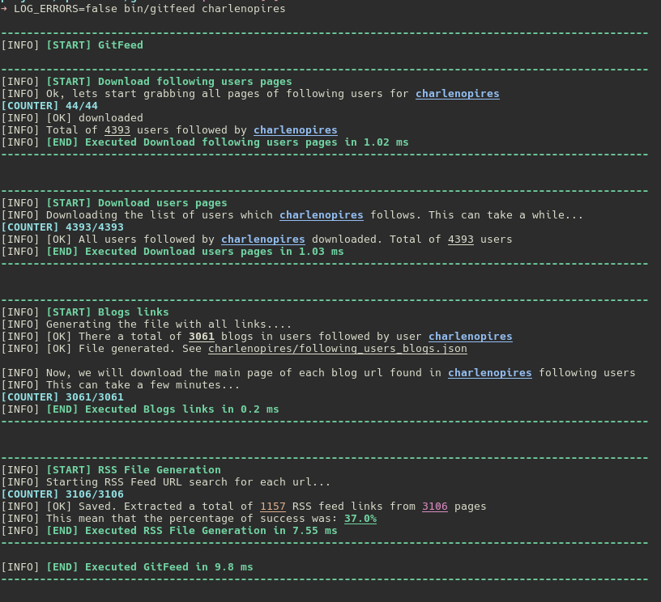

# GitFeed <gitfeed\>

---

## What's is this?

The purpose of this application it's to fetch all rss feeds links from the profile of people that you(or any person) follows in Github, so you can create a RSS feed based on people you **actually care about the content**.  

This is the first part of application, you may want to check the HTTP API and the HTTP Client.

---

## Running in development

**1 - Clone this repository:**

```
$ git clone git@github.com:fidelisrafael/gitfeed.git
```

**2 - Install ruby gems dependencies:**

```
$ bundle install
```

**3 - Generate Github API Token:**

**Note**: *This is optional, but you will not able to send too many requests to Github API since theres a [Rate limit](https://developer.github.com/v3/#rate-limiting) for HTTP requests without authorization.*

Now you will need a API Key token to fetch user data from Github API with increased Rate Limit.
Issue a new API token from [Github Interface](https://github.com/settings/tokens).
After issuing the token, generates a new file in root directory with name `.github-api-key` and add the token code there, eg:

```
$ echo 'MY_GITHUB_TOKEN' > .github-api-key
```

**4 - Run this thing!:**

```
$ bin/gitfeed [github_username]
```

Eg:

```
$ bin/gitfeed fidelisrafael
```

To **suppress** error messages logging(such caused by network error), run as:

```
$ LOG_ERRORS=false bin/gitfeed fidelisrafael
```

---

## How this works?

  

* **1 -** First the script fetch all users that one specific user follows in github, eg: [`fidelisrafael`](https://api.github.com/users/fidelisrafael/following)  
* **2 -** After this the script fetch the profile information of each user that is followed by this user to grab more specific information(more precise the `blog_url` attribute).  
* **3 -** In sequence, a JSON file with the **site urls** of all users fetched from Github is created, and a new process is started to concurrently download the main page of **each and all site url**  
* **4 -** And finally another process is executed to generate a final file with RSS feeds urls from the people you're following...**Pretty neat** no?

#### Example of a result file with RSS urls

```json
[
  "http://nielsjansen.dk/rss",
  "https://www.simplicidade.org/index.xml",
  "http://arguingwithalgorithms.blogspot.com/feeds/posts/default?alt=rss",
  "http://arguingwithalgorithms.blogspot.com/feeds/posts/default",
  "https://www.blogger.com/feeds/6812742250950078002/posts/default",
  "https://www.zorched.net/feed.xml",
  "http://orderedlist.com/feed.xml",
  "http://www.palmandplay.com/feed/",
  "http://www.palmandplay.com/comments/feed/",
  "http://www.palmandplay.com/index-page/feed/",
  "http://lyonheart.us/index.xml",
  "http://lpgauth.com/feed",
  "https://medium.com/feed/@erszcz",
  "http://eenwereldmetlef.be/feed.xml",
]
```

---

## Credits

Rafael Fidelis \<rafaelfid3lis@gmail.com\>

---

## Observations

- Only tested on `ruby 2.4.0p0 (2016-12-24 revision 57164) [x86_64-linux]`